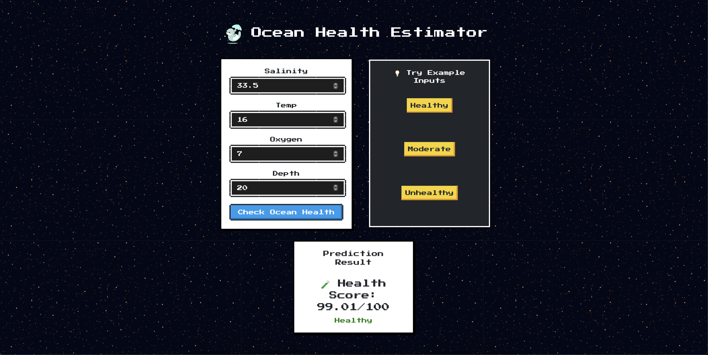

# 🌊 Ocean Health Predictor

A simple, retro-themed web app that predicts ocean health using **linear regression**. Enter ocean data like **salinity**, **temperature**, **oxygen**, and **depth**, and get a predicted health status: Healthy, Moderate, or Unhealthy.

Built using **React**, **Flask**, and **scikit-learn**.

---

I have used the [`Bottle Dataset`](https://www.kaggle.com/datasets/dftow001/bottle-csv) for this project which contains real data features like:
- Salinity
- Temperature
- Oxygen levels
- Depth

> **Note:** If you'd like to retrain the model, download `bottles.csv` from Kaggle and create a new folder data and place it in it.

---
## 🎯 Goal

A **Linear Regression** model is trained using `scikit-learn`, and the predicted score is categorized into:

- **Healthy** 
- **Moderate** 
- **Unhealthy** 

---

## ⚙️ How It Works

### Frontend (React)
- Styled with `NES.css` for a pixel-art look.
- Input form for user data.
- Example buttons to auto-fill sample values.
- Result card shows the prediction.

### Backend (Flask)
- API endpoint `/predict` handles POST requests.
- Trained model loads with `joblib`
- Data passed to the model, prediction returned.

### Machine Learning (scikit-learn)
- Linear Regression from `sklearn.linear_model`
- Features scaled and cleaned using `pandas` and `numpy`

---

## Screenshots

### Prediction Result

---
## 🚀 Getting Started

### Backend

```bash
pip install -r requirements.txt
python app.py
```
### Frontend
```bash
cd ocean-health-ui
npm install
npm run dev
```

## 🤝 Contributions

Contributions, ideas, and feedback are welcome!  
Feel free to open issues or submit pull requests.

If you'd like to improve the model, redesign the UI, or add new features — go for it! ✨

---

## 📄 License

This project is licensed under the [MIT License](LICENSE).

You are free to use, modify, and distribute this project — just leave a star ⭐ if you find it useful!